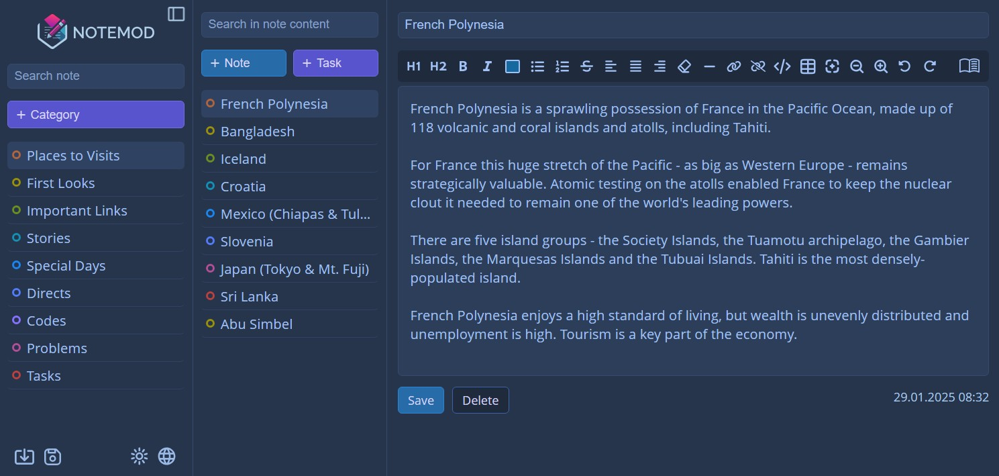

# Notemod - Open Source Free Note-Taking App

At **Notemod**, we believe that taking notes should be simple, powerful, and accessible to everyone. Whether you're a student, professional, or creative thinker, Notemod is designed to streamline your note-taking experience with a modern touch.

---

## Features

Here’s what makes Notemod stand out:

- **Easy Note-Taking**: Add notes quickly and effortlessly. Focus on your ideas without any distractions.
- **Creating Tasks**: Ability to view tasks separately in active, today, overdue and completed tabs.
- **Rich Text Editor**: Format your notes with ease using our feature-rich editor. Bold, italicize, underline, and more – your notes, your way.
- **Synchronization**: This feature allows you to synchronize your notes between different devices. Thus, you can access your notes anytime and anywhere. The synchronization process is performed through a special Gist file that will be created in your GitHub account.
- **Save All Your Data**: Never lose your thoughts. Your data belongs to you and is saved in localstorage in the browser you will use. With Notemod, your data is always in your hands. Our export and import features allow you to easily download your notes to your computer for safekeeping or transfer them between devices.
- **Open-Source Freedom**: Notemod is fully open-source, giving you complete control and transparency over your note-taking tool.
- **Offline Access**: Need to work offline? No problem. You can download our application as a simple HTML file and use it easily on your personal computer.

---

## Get Started

You can download our application notemod.html file and run it in the browser or you can use it online by clicking the link below.

[Notemod Online](https://app-notemod.blogspot.com)

## License

This project is licensed under the [MIT License](LICENSE). Feel free to use, modify, and distribute it as you wish
